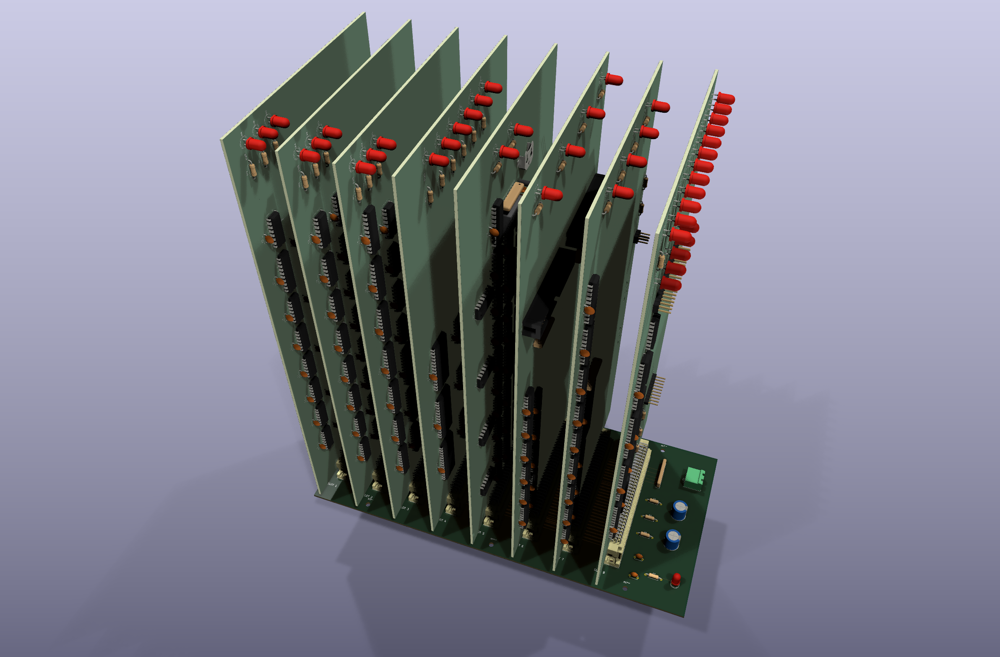
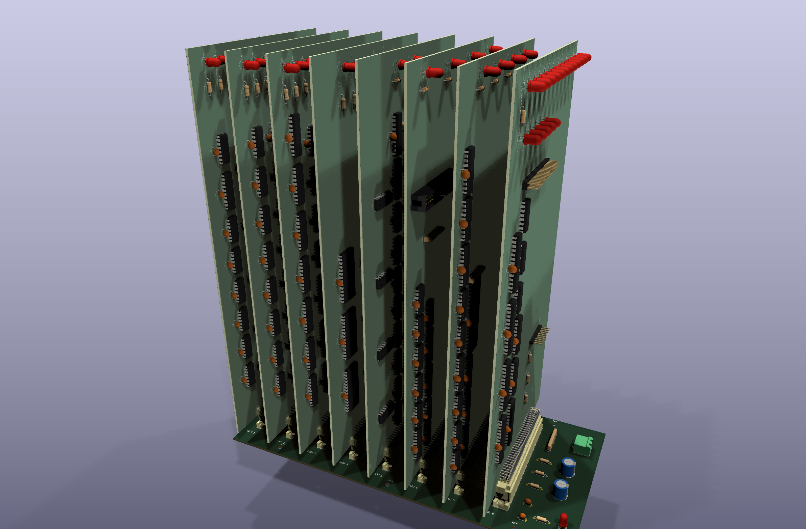
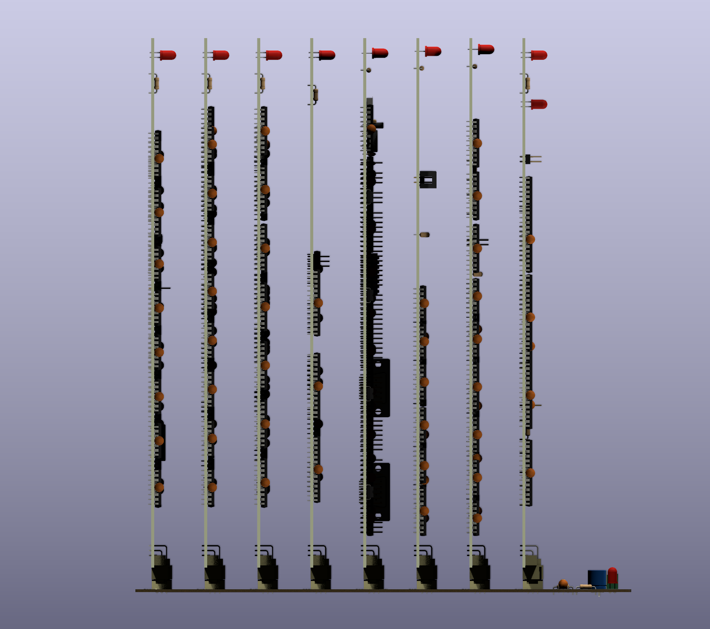

# The assembled machine — 3D render

The backplane with all eight plug-in cards standing in their DIN 41612 slots, each
card populated with its parts as laid out in KiCad. The images are rendered from
the board files by [`generators/render_assembly.py`](../../generators/render_assembly.py);
nothing here is drawn by hand.



*Front-top-side view onto the component sides; slot 8 (the bus test card) and the
power entry are nearest.*



*A lower view along the row of sockets, showing the mated connectors.*



*Orthographic elevation looking along the sockets, slot 1 on the left: the cards
standing on the backplane, each card's parts within the 28 mm slot pitch.*

## Which card is in which slot

| Slot | Socket | Card |
|------|--------|------|
| 1 | J1 | [Control / microcode](../control-card/README.md) |
| 2 | J2 | [Register bank](../regbank-card/README.md) |
| 3 | J3 | [ALU](../alu-card/README.md) |
| 4 | J4 | [Memory](../memory-card/README.md) |
| 5 | J5 | [I/O](../io-card/README.md) |
| 6 | J6 | [CF-IDE](../cf-card/README.md) |
| 7 | J7 | [PS/2](../ps2-card/README.md) |
| 8 | J8 | [Bus test](../bustest-card/p8x-bustest-card-design.md) |

Every slot carries the same bus, so no card is tied to a slot electrically. The
render uses the order of the CPU data path, then the peripherals, with the bring-up
bus test card in the last slot, next to the power entry. Slot 1 is the socket at
the left end of the backplane (silkscreen `SLOT 1`), away from the power entry.

## What the render shows, and how it is put together

- **Orientation.** Each card stands perpendicular to the backplane with its
  connector edge down. All cards face the same way: the component side towards
  slot 8 and the power entry, the solder side towards slot 1. Row a of the card's
  right-angle connector is the row nearest the card surface, and it mates with
  row a of the socket.
- **Seating.** The cards are fully mated: the top face of each female socket
  (11.6 mm above the backplane) meets the inner face of the card connector's shroud.
  That puts the card's lower edge 11.35 mm above the backplane surface.
- **Overhang.** The 140 mm card edge is longer than the 128 mm backplane, and the
  connector is centred on the card but not on the backplane, so each card extends
  8 mm past one end of the backplane and 4 mm past the other.

The generator derives the placement from the boards rather than placing anything
by eye. It reads the pad positions of each card's J1 and of the slot socket
(`SLOT1`..`SLOT8`) with pcbnew, and measures the insertion depth from the two
connector 3D models (STL exports of J1 alone). From these it builds the one proper
rotation (no mirror) that lines up pins 1→32 and rows a→c, and solves KiCad's
3D-model rotation angles for it. Each card is exported as a STEP with its component
models, silkscreen and solder mask. A scratch copy of the backplane then gets one
footprint per slot, holding that card's STEP as its only 3D model, and
`kicad-cli pcb render` draws the three views.

## Rebuilding

```sh
sh hardware/assembly/build.sh            # scratch files in $TMPDIR/p8x-assembly
sh hardware/assembly/build.sh /some/dir  # or a scratch directory of your own
```

It needs KiCad 10 and takes about four minutes (eight STEP exports and three
high-quality renders). The real boards are only read: each one is copied into the
scratch directory, the card STEPs and the assembly board are built there, and only
the PNG files in this directory are written. Rebuild after any change to a board's
placement or parts. The slot order and the camera views are the `SLOTS` and `VIEWS`
tables at the top of the generator.

## Limits of the render

- The two PS/2 mini-DIN sockets on the PS/2 card use a custom footprint with no 3D
  model, so they are missing from that card. Every other part has a model, though
  exotic parts use the closest standard KiCad footprint and model.
- The cards are drawn with silkscreen and solder mask but without their copper
  tracks (tracks would make each card's STEP several times larger). The backplane
  is drawn by KiCad directly, tracks included.
- The KiCad library models of the two DIN 41612 halves are simplified: at the mating
  face the socket's insertion body is slightly wider than the plug shroud's opening,
  so the two models overlap a little there. This does not show at these scales.
- The boards use plain DIP footprints, so IC sockets do not appear: the chips sit
  directly on the board.
